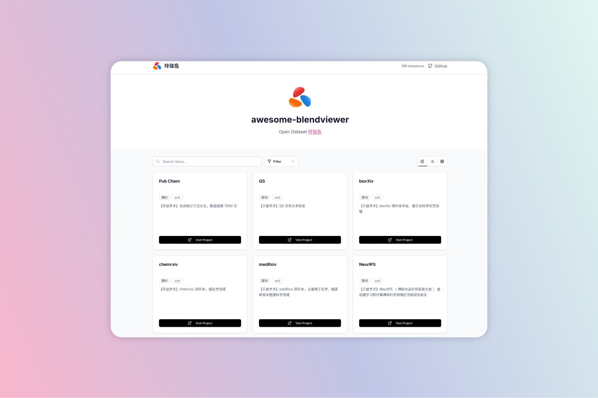

   
  
   
   

<h2 align='center'>awesome-blendviewer</h2>

A curated list of awesome things related to <a href='https://www.blendviewer.com/' target="_blank">blendviewer</a>
  

<i>Created by: <a href='https://www.blendviewer.com/' target="_blank">www.blendviewer.com</a></i>
  

## 期刊

| Name     | Description                                                                                | Link                                                                              | License |
| -------- | ------------------------------------------------------------------------------------------ | --------------------------------------------------------------------------------- | ------- |
| Pub Chem | 【开放学术】化合物分子式大全，数据规模 7000 万                                             | [Link](https://www.blendviewer.com/projects/e9304b00-382f-11f0-9358-8de6fca36d84) | cc0     |
| QS       | 【开放学术】QS 世界大学排名                                                                | [Link](https://www.blendviewer.com/projects/c748bf50-382e-11f0-9358-8de6fca36d84) | cc0     |
| biorXiv  | 【开放学术】biorXiv 预印本平台，偏生命科学研究领域                                         | [Link](https://www.blendviewer.com/projects/cf990080-382d-11f0-9358-8de6fca36d84) | cc0     |
| chemrxiv | 【开放学术】chemrxiv 预印本，偏化学领域                                                    | [Link](https://www.blendviewer.com/projects/71681230-37a6-11f0-b146-570b5c51e837) | cc0     |
| medRxiv  | 【开放学术】medRxiv 预印本，主要用于医学、临床和相关健康科学领域                           | [Link](https://www.blendviewer.com/projects/c86a6680-382f-11f0-9358-8de6fca36d84) | cc0     |
| NeurIPS  | 【开放学术】NeurIPS （ 神经信息处理系统大会 ）‌ 是机器学习和计算神经科学领域的顶级国际会议 | [Link](https://www.blendviewer.com/projects/18166fa0-382e-11f0-9358-8de6fca36d84) | cc0     |
| EdArXiv  | 【开放学术】EdArXiv 预印本，致力于发布教育领域的手稿。                                     | [Link](https://www.blendviewer.com/projects/967e2180-37a7-11f0-8f99-a3bf6e5a8382) | cc0     |
| engrXiv  | 【开放学术】engrXiv（Engineering Archive）论文， 致力于快速有效地传播工程知识              | [Link](https://www.blendviewer.com/projects/e57e2a60-382d-11f0-9358-8de6fca36d84) | cc0     |
| PsyArXiv | 【开放学术】PsyArXiv 预印本，致力于发布精神病学领域的手稿                                  | [Link](https://www.blendviewer.com/projects/117d2210-2ebf-11f0-8e03-5bb693aa3e51) | cc0     |
| Arxiv    | 【开放学术】约 270 万篇 Arxiv 论文，覆盖计算机、物理、数学、生物、量子力学等领域。         | [Link](https://www.blendviewer.com/projects/788d77d0-1d49-11ef-861a-b3174c760332) | cc0     |

## 音乐

| Name           | Description                | Link                                                                              | License |
| -------------- | -------------------------- | --------------------------------------------------------------------------------- | ------- |
| Spotify 元数据 | 【在线音乐】Spotify 元数据 | [Link](https://www.blendviewer.com/projects/c18d32c0-382f-11f0-9358-8de6fca36d84) | cc0     |
| 古风音乐       | 【轻音乐】古风音乐分享     | [Link](https://www.blendviewer.com/projects/0c8bbd70-ff17-11ef-9052-0d67d817c988) | cc0     |

## 3D

| Name           | Description                                 | Link                                                                              | License |
| -------------- | ------------------------------------------- | --------------------------------------------------------------------------------- | ------- |
| 英雄模型       | 【3D 打印】图纸合集，包含漫威超级英雄等模型 | [Link](https://www.blendviewer.com/projects/e4a33100-172e-11f0-952e-4b9171a91927) | unknown |
| 飞行器         | 【3D】RC 飞行器                             | [Link](https://www.blendviewer.com/projects/949d2710-6127-11ee-a9ec-a94bb7621401) | unknown |
| Raspberry Pi   | 【3D 模型】树莓派 Raspberry Pi 图纸         | [Link](https://www.blendviewer.com/projects/9dd9e180-644f-11ee-a9ec-a94bb7621401) | unknown |
| 钢笔模型       | 【3D】钢笔模型                              | [Link](https://www.blendviewer.com/projects/4138bde0-b76d-11ee-bb8f-79d0b7d03d0a) | unknown |
| Christmas tree | 【3D】Christmas tree                        | [Link](https://www.blendviewer.com/projects/84603a90-acae-11ee-bbcc-bba81cf65baf) | unknown |
| YD-ESP32-S3    | 【3D】YD-ESP32-S3                           | [Link](https://www.blendviewer.com/projects/c5ed8520-b76d-11ee-a818-6df2f18e61f1) | unknown |
| p250           | 【3D 打印】sig p250 模型                    | [Link](https://www.blendviewer.com/projects/67da2d20-61c4-11ee-989d-d97498fbcf7b) | unknown |
| 四方桌         | 【3D】家具：四方桌                          | [Link](https://www.blendviewer.com/projects/9fc71ea0-9059-11ee-b4cd-1b06f3a1add4) | unknown |
| SERVO MOTOR    | 【3D 模型】SERVO MOTOR                      | [Link](https://www.blendviewer.com/projects/62184f40-6447-11ee-a6b3-f33c76d327cf) | unknown |
| B360N          | 【3D】技嘉 B360N WIFI 模型                  | [Link](https://www.blendviewer.com/projects/ed87e350-6114-11ee-989d-d97498fbcf7b) | unknown |
| 差速器         | 【3D】差速器                                | [Link](https://www.blendviewer.com/projects/794084a0-6440-11ee-a6b3-f33c76d327cf) | unknown |
| Desert         | 【3D 打印】Desert eagle mark XIX .4         | [Link](https://www.blendviewer.com/projects/c35531e0-8055-11ee-8d13-85bfc2aedcc3) | unknown |

## 工具集

| Name        | Description                                                          | Link                                                                              | License |
| ----------- | -------------------------------------------------------------------- | --------------------------------------------------------------------------------- | ------- |
| Explain     | 【工具集】SQL Explain 可视化工具，可以快速地分析 sql 性能瓶颈        | [Link](https://www.blendviewer.com/projects/7236af00-5719-11ef-8ada-0d7ac649c4da) | unknown |
| DataVoyager | 【工具集】数据探索 DataVoyager                                       | [Link](https://www.blendviewer.com/projects/38cd5910-9b77-11ef-ae7e-f1377e0d6a9a) | unknown |
| Netron      | 【工具集】Netron 神经网络、深度学习和机器学习模型查看器              | [Link](https://www.blendviewer.com/projects/74c5db60-5787-11ef-8ada-0d7ac649c4da) | unknown |
| 工具集      | 【工具集】一个用于在浏览器中创建类似于虚幻蓝图的 JavaScript 图形库， | [Link](https://www.blendviewer.com/projects/6b7bce10-5a3f-11ef-aeb7-21daabc99b09) | unknown |
| DrawDB      | 【工具集】DrawDB 数据库实体关系（DBER）编辑器。                      | [Link](https://www.blendviewer.com/projects/770c7ec0-5781-11ef-af55-4931ddb38d58) | unknown |
| Cron        | 【工具集】Cron 表达式在线生成与解析                                  | [Link](https://www.blendviewer.com/projects/d1786280-5a3c-11ef-a31e-19d8e8299e39) | unknown |
| 工具集      | 【工具集】对于 IT 工作人员来说有用的工具                             | [Link](https://www.blendviewer.com/projects/f43d5ce0-577f-11ef-ac8b-a17b6ec995ae) | unknown |
| Json crack  | 【工具集】Json crack 一个高效的 JSON/YAML/XML/CSV 可视化工具         | [Link](https://www.blendviewer.com/projects/fbcdb500-5774-11ef-8ada-0d7ac649c4da) | unknown |
| 正则表达式  | 【工具集】正则表达式可视化与编辑器工具                               | [Link](https://www.blendviewer.com/projects/8cd617e0-59d2-11ef-a31e-19d8e8299e39) | unknown |

## 摄影集

| Name                         | Description                                                           | Link                                                                              | License |
| ---------------------------- | --------------------------------------------------------------------- | --------------------------------------------------------------------------------- | ------- |
| 凯瑟尔的中国摄影集           | 美国.凯瑟尔的中国摄影集（1940-1956）                                  | [Link](https://www.blendviewer.com/projects/76b1bd50-fdc1-11ef-a47f-cdd7dc2d6364) | unknown |
| 晚清民国时期中国名胜古迹图集 | 日本.常盘大定.晚清民国时期中国名胜古迹图集                            | [Link](https://www.blendviewer.com/projects/17d8a050-fdb7-11ef-a47f-cdd7dc2d6364) | unknown |
| 柏原英一的摄影集             | 日本.柏原英一的摄影集（于 1938-1942 武汉 北京 上海 抗日战争时期拍摄） | [Link](https://www.blendviewer.com/projects/f57fc720-fdb3-11ef-91af-9d80ad015b34) | unknown |
| 哈里森. 福尔曼的中国摄影集   | 美国.哈里森. 福尔曼的中国摄影集（1932-1973）                          | [Link](https://www.blendviewer.com/projects/3b689140-fcba-11ef-8695-ff3fa1f10883) | unknown |
| 迈登斯二战中国摄影集         | 美国.迈登斯二战中国摄影集（1940-1949）                                | [Link](https://www.blendviewer.com/projects/b8f4b230-fc1d-11ef-8dd8-d9f011779be5) | unknown |
| 美国.伯恩斯的中国摄影集      | 美国.伯恩斯的中国摄影集（1947-1949）                                  | [Link](https://www.blendviewer.com/projects/fd5800d0-fbff-11ef-bbde-b5c5c0182808) | unknown |
| 美国.马克·考夫曼中国摄影集   | 美国.马克·考夫曼中国摄影集（1945-1949）                               | [Link](https://www.blendviewer.com/projects/6800aaa0-fc1d-11ef-bbde-b5c5c0182808) | unknown |
| 赫达·莫里逊.民国时期的中国   | 德国.赫达·莫里逊.民国时期的中国（1933-1946）                          | [Link](https://www.blendviewer.com/projects/e160d350-fbbb-11ef-bbde-b5c5c0182808) | unknown |
| 费利斯·比托中国影像集        | 英国.费利斯·比托中国影像集（1860-1871 年）                            | [Link](https://www.blendviewer.com/projects/5be37b90-fc21-11ef-bbde-b5c5c0182808) | unknown |
| 通州往事                     | 摄影师 Dmitri Kessel 中国乡村旧影-通州往事（~1946）                   | [Link](https://www.blendviewer.com/projects/6cce1ff0-36af-11f0-8f99-a3bf6e5a8382) | unknown |
| 鸟瞰中国                     | 德国.飞行员 J. P. Koster.鸟瞰中国（～ 1940 ）                         | [Link](https://www.blendviewer.com/projects/3024a840-fe8c-11ef-a47f-cdd7dc2d6364) | unknown |
| 黎芳中国摄影集               | 美国/英国.黎芳中国摄影集（1879、1869、1870、1920 ）                   | [Link](https://www.blendviewer.com/projects/236e5c90-fe87-11ef-bf0c-8db407b622a2) | unknown |
| 关心亚洲学者委员会           | 美国.关心亚洲学者委员会（CCAS）中国摄影集（1971-1972）                | [Link](https://www.blendviewer.com/projects/69894010-fe86-11ef-91af-9d80ad015b34) | unknown |
| 杜德维的相册                 | 美国.杜德维的相册（1876-1895）                                        | [Link](https://www.blendviewer.com/projects/f162b1d0-fe84-11ef-91af-9d80ad015b34) | unknown |
| 中国的建筑与景观             | 德国.中国的建筑与景观（ 1906-1909）                                   | [Link](https://www.blendviewer.com/projects/ded7cbf0-fe83-11ef-a47f-cdd7dc2d6364) | unknown |
| 拉里贝的中国影像记录         | 法国.拉里贝的中国影像记录（1900-1910）                                | [Link](https://www.blendviewer.com/projects/389cb660-fe83-11ef-91af-9d80ad015b34) | unknown |
| 中国访问团摄影集             | 《卫报》中国访问团摄影集                                              | [Link](https://www.blendviewer.com/projects/e868e700-fe81-11ef-91af-9d80ad015b34) | unknown |
| 蒙古使团摄影集               | 瑞典.蒙古使团摄影集                                                   | [Link](https://www.blendviewer.com/projects/a1e82480-fe7c-11ef-bf0c-8db407b622a2) | unknown |
| 拉克斯的中国摄影集           | 美国.拉克斯的中国摄影集                                               | [Link](https://www.blendviewer.com/projects/5911e700-fe7c-11ef-a47f-cdd7dc2d6364) | unknown |
| 多米尼斯的中国摄影集         | 美国.多米尼斯的中国摄影集                                             | [Link](https://www.blendviewer.com/projects/1b99f560-fe78-11ef-a47f-cdd7dc2d6364) | unknown |
| 张伯林的中国摄影集           | 美国.张伯林的中国摄影集（1909-1910）                                  | [Link](https://www.blendviewer.com/projects/35278be0-fdca-11ef-91af-9d80ad015b34) | unknown |

## 艺术馆

| Name                                         | Description                                              | Link                                                                              | License |
| -------------------------------------------- | -------------------------------------------------------- | --------------------------------------------------------------------------------- | ------- |
| 台北故宫博物馆                               | 【数字艺术馆】台北故宫博物馆                             | [Link](https://www.blendviewer.com/projects/2661cdf0-faa0-11ef-8dd8-d9f011779be5) | cc0     |
| 大都会艺术博物馆                             | 【数字美术馆】大都会艺术博物馆                           | [Link](https://www.blendviewer.com/projects/4b84d3e0-1647-11ef-b3a6-2596bf54ac18) | cc0     |
| 丹麦斯卡恩美术馆                             | 【数字美术馆】丹麦斯卡恩美术馆                           | [Link](https://www.blendviewer.com/projects/8b8e7e10-15b5-11ef-a141-7b11487d73ad) | cc0     |
| 美国波士顿美术馆                             | 【数字美术馆】美国波士顿美术馆                           | [Link](https://www.blendviewer.com/projects/1b96b4f0-1624-11ef-ad17-d96671012775) | unknown |
| 美国波士顿美术馆                             | 【数字美术馆】美国波士顿美术馆                           | [Link](https://www.blendviewer.com/projects/fcbfd4c0-165b-11ef-9c24-9d1d9b67cf75) | unknown |
| 美国洛杉矶保罗盖蒂博物馆                     | 【数字美术馆】美国洛杉矶保罗盖蒂博物馆                   | [Link](https://www.blendviewer.com/projects/eb2a0570-1627-11ef-ad17-d96671012775) | unknown |
| 法国历史博物馆                               | 【数字美术馆】法国历史博物馆                             | [Link](https://www.blendviewer.com/projects/c2b88fc0-161e-11ef-ad17-d96671012775) | unknown |
| 美国弗利克美术馆                             | 【数字美术馆】美国弗利克美术馆                           | [Link](https://www.blendviewer.com/projects/6ab62af0-1621-11ef-ad17-d96671012775) | unknown |
| 奥地利维也纳艺术史博物馆                     | 【数字美术馆】奥地利维也纳艺术史博物馆                   | [Link](https://www.blendviewer.com/projects/e856f6d0-15fc-11ef-8046-45a76818d4c5) | unknown |
| 荷兰莫瑞泰斯皇家美术馆                       | 【数字美术馆】荷兰莫瑞泰斯皇家美术馆                     | [Link](https://www.blendviewer.com/projects/b7747fd0-1668-11ef-a253-1971fc328172) | unknown |
| 大英博物馆                                   | 【数字美术馆】大英博物馆                                 | [Link](https://www.blendviewer.com/projects/9c1f6b10-15ea-11ef-8b89-67370a264271) | unknown |
| 美国费城美术馆                               | 【数字美术馆】美国费城美术馆                             | [Link](https://www.blendviewer.com/projects/71500bf0-1654-11ef-b3a6-2596bf54ac18) | unknown |
| 巴黎奥赛博物馆                               | 【数字美术馆】巴黎奥赛博物馆                             | [Link](https://www.blendviewer.com/projects/67b38c90-1611-11ef-ad17-d96671012775) | unknown |
| 英国国家肖像艺术博物馆                       | 【数字美术馆】英国国家肖像艺术博物馆                     | [Link](https://www.blendviewer.com/projects/8c508e50-16a1-11ef-836f-c365ea40561b) | unknown |
| 西班牙喀门蒂森美术馆                         | 【数字美术馆】西班牙喀门蒂森美术馆                       | [Link](https://www.blendviewer.com/projects/4cfd6c80-167b-11ef-a253-1971fc328172) | unknown |
| 美国洛杉矶国家美术馆                         | 【数字美术馆】美国洛杉矶国家美术馆                       | [Link](https://www.blendviewer.com/projects/2d652f00-162d-11ef-ad17-d96671012775) | unknown |
| 法国卢浮宫                                   | 【数字美术馆】法国卢浮宫                                 | [Link](https://www.blendviewer.com/projects/2e9944b0-03c2-11ef-8490-8550e426bbe9) | unknown |
| 列支敦士登皇家美术馆                         | 【数字美术馆】列支敦士登皇家美术馆                       | [Link](https://www.blendviewer.com/projects/7375a3f0-15b8-11ef-8e87-9d9afa569c56) | unknown |
| 美国菲利普美术馆                             | 【数字美术馆】美国菲利普美术馆                           | [Link](https://www.blendviewer.com/projects/f4451ea0-1650-11ef-b3a6-2596bf54ac18) | unknown |
| 荷兰海牙市立美术馆                           | 【数字美术馆】荷兰海牙市立美术馆                         | [Link](https://www.blendviewer.com/projects/2d8307b0-1663-11ef-a253-1971fc328172) | unknown |
| 西班牙普拉多美术馆                           | 【数字美术馆】西班牙普拉多美术馆                         | [Link](https://www.blendviewer.com/projects/b2c43d90-16bd-11ef-b8e3-8791621c98c3) | unknown |
| 匈牙利国家美术馆                             | 【数字美术馆】匈牙利国家美术馆                           | [Link](https://www.blendviewer.com/projects/5c3a94c0-15bd-11ef-a98c-85fb01c79875) | unknown |
| 荷兰阿姆斯特丹国家美术馆                     | 【数字美术馆】荷兰阿姆斯特丹国家美术馆                   | [Link](https://www.blendviewer.com/projects/1f927a60-1676-11ef-a253-1971fc328172) | unknown |
| 挪威艺术博物馆                               | 【数字美术馆】挪威艺术博物馆                             | [Link](https://www.blendviewer.com/projects/e4136cd0-1614-11ef-ad17-d96671012775) | unknown |
| 奥地利维也纳阿尔贝蒂娜美术馆                 | 【数字美术馆】奥地利维也纳阿尔贝蒂娜美术馆               | [Link](https://www.blendviewer.com/projects/50942740-160c-11ef-ad17-d96671012775) | unknown |
| 比利时格罗宁格博物馆                         | 【数字美术馆】比利时格罗宁格博物馆                       | [Link](https://www.blendviewer.com/projects/7cb7e7d0-161b-11ef-ad17-d96671012775) | unknown |
| 宫内厅书陵部宋元善本（高清图片格式）         | 【华夏古籍】宫内厅书陵部宋元善本（高清图片格式）         | [Link](https://www.blendviewer.com/projects/f020fe80-1bda-11f0-98d1-97db7e871c11) | unknown |
| （校对版）古籍全文本格式系列，以经史子集分类 | 【华夏古籍】（校对版）古籍全文本格式系列，以经史子集分类 | [Link](https://www.blendviewer.com/projects/6542da20-15fb-11f0-b885-2d094b2c00e0) | unknown |
| 日本内阁文库汉籍                             | 【华夏古籍】日本内阁文库汉籍                             | [Link](https://www.blendviewer.com/projects/609f0110-1b8c-11f0-a7c8-d58cb4d6eede) | cc0     |
| 朝鲜本汉籍                                   | 【华夏古籍】朝鲜本汉籍                                   | [Link](https://www.blendviewer.com/projects/f1236680-1b2e-11f0-93ce-6b039ecbdbfe) | cc0     |
| 永乐大典                                     | 【华夏古籍】永乐大典                                     | [Link](https://www.blendviewer.com/projects/07b1fd00-fa44-11ef-87be-57e52014eab1) | unknown |
| 静嘉堂文库宋元本                             | 【华夏古籍】静嘉堂文库宋元本                             | [Link](https://www.blendviewer.com/projects/15b34800-12ef-11f0-8dea-157cf5c5a4bb) | unknown |
| 香港冯平山图书馆                             | 【华夏古籍】香港冯平山图书馆                             | [Link](https://www.blendviewer.com/projects/e663ec30-12ee-11f0-892e-6704e2ffbf7f) | unknown |
| 哈佛大学图书馆汉籍                           | 【华夏古籍】哈佛大学图书馆汉籍                           | [Link](https://www.blendviewer.com/projects/dca52290-0aba-11f0-808e-b9e22e206b86) | unknown |
| 原平图善本                                   | 【华夏古籍】原平图善本                                   | [Link](https://www.blendviewer.com/projects/811922f0-12ee-11f0-a1d6-c9cc745dec22) | unknown |
| 早稻田大学图书馆汉籍                         | 【华夏古籍】早稻田大学图书馆汉籍                         | [Link](https://www.blendviewer.com/projects/e452a680-133d-11f0-8dea-157cf5c5a4bb) | unknown |
| 明.吴彬                                      | 【国风】历代书画：明.吴彬                                | [Link](https://www.blendviewer.com/projects/71bf7cf0-dde8-11ee-ba82-e1344f1377ba) | unknown |
| 宋.米芾                                      | 【国风】历代书画：宋.米芾                                | [Link](https://www.blendviewer.com/projects/53984db0-0480-11ef-90f5-e36301a54322) | unknown |
| 宋.朱熹                                      | 【国风】历代书画：宋.朱熹                                | [Link](https://www.blendviewer.com/projects/fe4026b0-0495-11ef-a587-a318ddbb3760) | unknown |
| 宋.范仲淹                                    | 【国风】历代书画：宋.范仲淹                              | [Link](https://www.blendviewer.com/projects/59998810-047a-11ef-8490-8550e426bbe9) | unknown |
| 宋.岳飞                                      | 【国风】历代书画：宋.岳飞                                | [Link](https://www.blendviewer.com/projects/246e3f30-1b60-11ef-825b-afbdb9762d39) | unknown |
| 宋.薛绍彭                                    | 【国风】历代书画：宋.薛绍彭                              | [Link](https://www.blendviewer.com/projects/25b2cd20-1b60-11ef-825b-afbdb9762d39) | unknown |
| 宋.金大受                                    | 【国风】历代书画：宋.金大受                              | [Link](https://www.blendviewer.com/projects/24d56fe0-047f-11ef-90f5-e36301a54322) | unknown |
| 唐.吴道子                                    | 【国风】历代书画：唐.吴道子                              | [Link](https://www.blendviewer.com/projects/e3753060-ef59-11ee-89f1-db23fcd33ca2) | unknown |
| 宋.崔白                                      | 【国风】历代书画：宋.崔白                                | [Link](https://www.blendviewer.com/projects/e9d3e760-0478-11ef-8490-8550e426bbe9) | unknown |
| 宋.宋惠崇                                    | 【国风】历代书画：宋.宋惠崇                              | [Link](https://www.blendviewer.com/projects/f332d540-047e-11ef-8490-8550e426bbe9) | unknown |
| 宋.李公鳞                                    | 【国风】历代书画：宋.李公鳞                              | [Link](https://www.blendviewer.com/projects/55ebcaf0-063e-11ef-a587-a318ddbb3760) | unknown |
| 宋.张即之                                    | 【国风】历代书画：宋.张即之                              | [Link](https://www.blendviewer.com/projects/f8decf70-0493-11ef-8490-8550e426bbe9) | unknown |
| 宋.文天祥                                    | 【国风】历代书画：宋.文天祥                              | [Link](https://www.blendviewer.com/projects/5d49ee70-0491-11ef-a587-a318ddbb3760) | unknown |
| 宋.陈容                                      | 【国风】历代书画：宋.陈容                                | [Link](https://www.blendviewer.com/projects/3c08efe0-0478-11ef-a587-a318ddbb3760) | unknown |
| 宋.黄庭坚                                    | 【国风】历代书画：宋.黄庭坚                              | [Link](https://www.blendviewer.com/projects/65939000-047c-11ef-90f5-e36301a54322) | unknown |
| 宋.宋孝宗赵皆                                | 【国风】历代书画：宋.宋孝宗赵皆                          | [Link](https://www.blendviewer.com/projects/189ce1e0-0489-11ef-90f5-e36301a54322) | unknown |
| 宋.郭熙                                      | 【国风】历代书画：宋.郭熙                                | [Link](https://www.blendviewer.com/projects/7cd977d0-047b-11ef-8490-8550e426bbe9) | unknown |
| 宋.苏汉臣                                    | 【国风】历代书画：宋.苏汉臣                              | [Link](https://www.blendviewer.com/projects/11ce36b0-0642-11ef-8490-8550e426bbe9) | unknown |
| 宋.马远                                      | 【国风】历代书画：宋.马远                                | [Link](https://www.blendviewer.com/projects/d09799f0-063e-11ef-8490-8550e426bbe9) | unknown |
| 宋.李成                                      | 【国风】历代书画：宋.李成                                | [Link](https://www.blendviewer.com/projects/56c31d40-047f-11ef-a587-a318ddbb3760) | unknown |
| 宋.法常                                      | 【国风】历代书画：宋.法常                                | [Link](https://www.blendviewer.com/projects/243742d0-0479-11ef-90f5-e36301a54322) | unknown |
| 宋.武宗元                                    | 【国风】历代书画：宋.武宗元                              | [Link](https://www.blendviewer.com/projects/dc454c00-0492-11ef-90f5-e36301a54322) | unknown |
| 宋.范宽                                      | 【国风】历代书画：宋.范宽                                | [Link](https://www.blendviewer.com/projects/c2029dc0-0479-11ef-a587-a318ddbb3760) | unknown |
| 元.赵孟頫 行书                               | 【国风】历代书画 ：元 赵孟頫 行书                        | [Link](https://www.blendviewer.com/projects/032034d0-fb28-11ee-9b31-65e93ec28e6c) | unknown |
| 宋.赵伯驹                                    | 【国风】历代书画：宋.赵伯驹                              | [Link](https://www.blendviewer.com/projects/25c62e10-1b60-11ef-825b-afbdb9762d39) | unknown |
| 宋.宋仁宗                                    | 【国风】历代书画：宋.宋仁宗                              | [Link](https://www.blendviewer.com/projects/24028510-1b60-11ef-825b-afbdb9762d39) | unknown |
| 明四家 仇英                                  | 【国风】历代书画：明四家 仇英                            | [Link](https://www.blendviewer.com/projects/8f4e2d70-ef0e-11ee-8891-cddf720ed8c7) | unknown |
| 宋.文同                                      | 【国风】历代书画：宋.文同                                | [Link](https://www.blendviewer.com/projects/24ade040-1b60-11ef-825b-afbdb9762d39) | unknown |
| 宋.李赞华                                    | 【国风】历代书画：宋.李赞华                              | [Link](https://www.blendviewer.com/projects/997bcd80-047f-11ef-a587-a318ddbb3760) | unknown |
| 宋.梁师闵                                    | 【国风】历代书画：宋.梁师闵                              | [Link](https://www.blendviewer.com/projects/cff4f670-047f-11ef-8490-8550e426bbe9) | unknown |
| 宋.赵孟坚                                    | 【国风】历代书画：宋.赵孟坚                              | [Link](https://www.blendviewer.com/projects/5d493d20-063c-11ef-8490-8550e426bbe9) | unknown |
| 宋.夏珪                                      | 【国风】历代书画：宋.夏珪                                | [Link](https://www.blendviewer.com/projects/23e8e290-1b60-11ef-825b-afbdb9762d39) | unknown |
| 宋.赵芾                                      | 【国风】历代书画：宋.赵芾                                | [Link](https://www.blendviewer.com/projects/260f6c10-1b60-11ef-825b-afbdb9762d39) | unknown |
| 宋.赵昌                                      | 【国风】历代书画：宋.赵昌                                | [Link](https://www.blendviewer.com/projects/25faf9b0-1b60-11ef-825b-afbdb9762d39) | unknown |
| 宋.李公麟                                    | 【国风】历代书画：宋.李公麟                              | [Link](https://www.blendviewer.com/projects/24f01960-1b60-11ef-825b-afbdb9762d39) | unknown |
| 宋.惠崇                                      | 【国风】历代书画：宋.惠崇                                | [Link](https://www.blendviewer.com/projects/24988380-1b60-11ef-825b-afbdb9762d39) | unknown |
| 宋.宋理宗赵昀                                | 【国风】历代书画：宋.宋理宗赵昀                          | [Link](https://www.blendviewer.com/projects/2444e540-1b60-11ef-825b-afbdb9762d39) | unknown |
| 宋.赵士雷                                    | 【国风】历代书画：宋.赵士雷                              | [Link](https://www.blendviewer.com/projects/25db63c0-1b60-11ef-825b-afbdb9762d39) | unknown |
| 宋.蔡京                                      | 【国风】历代书画：宋.蔡京                                | [Link](https://www.blendviewer.com/projects/259de590-1b60-11ef-825b-afbdb9762d39) | unknown |
| 宋.宋高宗赵构                                | 【国风】历代书画：宋.宋高宗赵构                          | [Link](https://www.blendviewer.com/projects/f706e6b0-0489-11ef-a587-a318ddbb3760) | unknown |
| 宋.宋微宗赵佶                                | 【国风】历代书画：宋.宋微宗赵佶                          | [Link](https://www.blendviewer.com/projects/9090c760-048a-11ef-90f5-e36301a54322) | unknown |
| 宋.梁楷                                      | 【国风】历代书画：宋.梁楷                                | [Link](https://www.blendviewer.com/projects/301c07d0-081a-11ef-8a75-6d08f154d1e8) | unknown |
| 宋.王诜                                      | 【国风】历代书画：宋.王诜                                | [Link](https://www.blendviewer.com/projects/3ffacc10-048f-11ef-90f5-e36301a54322) | unknown |
| 宋.刘松年                                    | 【国风】历代书画：宋.刘松年                              | [Link](https://www.blendviewer.com/projects/b3501480-0643-11ef-90f5-e36301a54322) | unknown |
| 宋.苏轼                                      | 【国风】历代书画：宋.苏轼                                | [Link](https://www.blendviewer.com/projects/a4d8dbb0-048d-11ef-8490-8550e426bbe9) | unknown |
| 宋.佚名                                      | 【国风】历代书画：宋.佚名                                | [Link](https://www.blendviewer.com/projects/02c12250-0493-11ef-a587-a318ddbb3760) | unknown |
| 宋.欧阳修                                    | 【国风】历代书画：宋.欧阳修                              | [Link](https://www.blendviewer.com/projects/f289ade0-0487-11ef-90f5-e36301a54322) | unknown |
| 宋.李迪                                      | 【国风】历代书画：宋.李迪                                | [Link](https://www.blendviewer.com/projects/120b3bc0-081b-11ef-abdc-f7bb2a485dba) | unknown |

## Star History

<picture>
  <source media="(prefers-color-scheme: dark)" srcset="https://api.star-history.com/svg?repos=blendviewer/awesome-blendviewer&type=Date&theme=dark" />
  <source media="(prefers-color-scheme: light)" srcset="https://api.star-history.com/svg?repos=blendviewer/awesome-blendviewer&type=Date" />
  
</picture>

## Contributors

Thanks goes to all these wonderful people:

